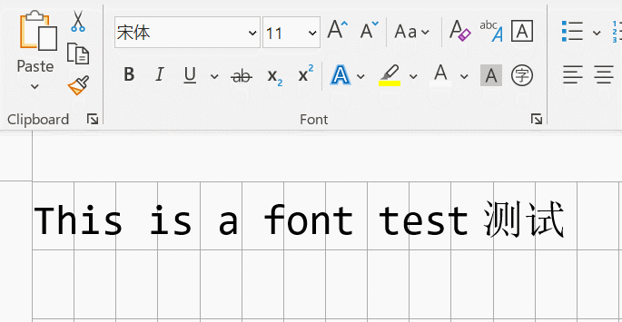

#! https://zhuanlan.zhihu.com/p/574107295

# Vscode 中英文字体混排比较

在 Vscode 编辑器中比较了下列中英文字体混排的模式:

1. Consolas + 宋体 
1. Cascadia Code + 宋体
1. Jetbrains Mono + 宋体 
1. Noto Sans Mono + 宋体 
1. Ubuntu Mono + 宋体
1. Roboto Mono + 宋体
1. 微软黑体(英)+微软黑体(中)
1. Noto Sans Sc (英)+ Noto Sans Sc (中) 思源黑体
1. Noto Sans Mono CJK Sc (英)+ Noto Sans CJK  Sc (中) 

## 结论：

1. Noto Sans Mono CJK Sc (中/英)是唯一完全对齐的。但是Noto Sans Mono CJK Sc 的O0不分:-(
2. Vscode 的缺省配置 `Consolas + 宋体` 整体对齐效果好一些, 仍然决定采用缺省方案。(备注：宋体是windows vscode 缺省)
3. 只在以中文为主的中英文混排文档(非编程)推荐 `Noto Sans Sc`

## 比较方法及结果

用26个中文字符，52个英文字符，以及中英文混杂字符(总和等同于52宽度)看对齐效果. 
理想情况三行长度应该完全相同

[字体比较](./asset_1016/test.png)]

## 说明

没有比较大家推荐的 `Consolas + 微软雅黑`，而是用缺省宋体作为比较的的原因有两点:

1. 在最新的Vscode中 font familiy 中设置 [Consolas, ‘Microsoft Yahei’]或者[Consolas, ‘微软雅黑’] 并不生效，中文仍然是宋体。如果把 Microsoft Yahei / 微软雅黑 放置在第一位 则 全部中英文都是雅黑字体。 另外的解决方法是下载网上的consolars + Yahei的 hybrid 字体，但这个我不想考虑.

1. 雅黑字体及大部分其他中文字体与英文字体基线高度并不相同,反而缺省字体宋体要效果好很多。

## 字体下载链接 

多为Google/Github官方网站链接。如无法连接，只能通过国内网站搜索

1. [Cascadia Code: Github](https://github.com/microsoft/cascadia-code/releases)
1. [Jetbrains Mono ](https://www.jetbrains.com/lp/mono/) 
1. [Noto Sans Sc: Google](https://fonts.google.com/noto/specimen/Noto+Sans+SC)
1. [Noto Sans Mono: Google](https://fonts.google.com/noto/specimen/Noto+Sans+Mono) 
1. [Noto Sans Mono CJK Sc: Github](https://github.com/googlefonts/noto-cjk/tree/main/Sans/Mono)
1. [Ubuntu Mono: Google](https://fonts.google.com/specimen/Ubuntu+Mono)
1. [Roboto Mono: Google](https://fonts.google.com/specimen/Roboto+Mono)
